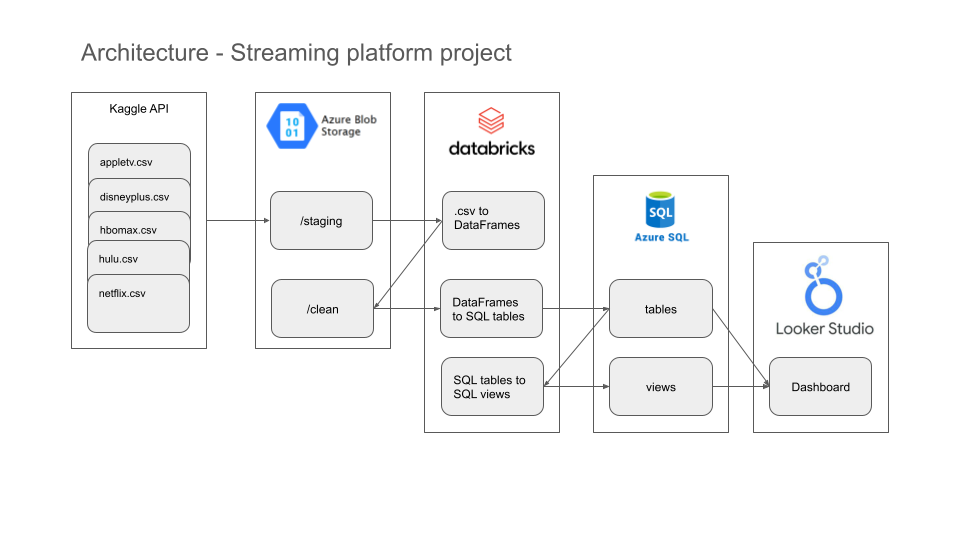

# Streaming platforms ETL pipeline using Databricks and Azure SQL Server

## Introduction
This project focuses on building an Extract, Transform, Load (ETL) pipeline that processes data from streaming platform datasets using modern cloud technologies. By leveraging Databricks, Azure SQL Server, and Looker Studio, the pipeline ensures  data integration, transformation, and visualization.
- Technology used: *Python, SQL, PySpark*

### Objective
The objective of this project is to design and implement an Extract, Transform, Load (ETL) pipeline for streaming platform datasets using Databricks and Azure SQL Server. This pipeline processes raw data, stores it in an Azure SQL database, and facilitates data visualization through Looker Studio.

### Key Components
- **Data Sources** - Publicly available datasets from [kaggle.com](https://www.kaggle.com/datasets/octopusteam/full-apple-tv-dataset) containing the content of streaming platforms Apple TV, Amazon, HBO, Hulu and Netflix. View [example dataset](https://github.com/datamannetje/databricks-etl-pipeline/blob/main/apple-tv-dataset.csv).
- **Data Storage** - Azure Blob Storage and SQL Server acts as the central repository for raw and processed data.
- **Data Processing Platform** - Databricks is utilized for ETL operations, leveraging PySpark to handle data processing.
- **Data Visualization Tool** - Looker Studio connects to Azure SQL Server to create interactive dashboards and visualizations.

### Architecture

- **Data Extraction** - Raw datasets are automatically downloaded from Kaggle via API and ingested into Azure Blob Storage as CSV files.
  - Python code: [kaggle-api-data-import-v2.ipynb](https://github.com/datamannetje/streaming-platforms-databricks-project/blob/main/kaggle-api-data-import-v2.ipynb)
- **Data Transformation & Loading** - Data is processed in Databricks using PySpark to handle missing values, remove duplicates, and standardize formats. The transformed data is written back to Azure SQL Server into dedicated tables optimized for queries. 
  - Python code: [dataset-etl-v2.ipynb](https://github.com/datamannetje/streaming-platforms-databricks-project/blob/main/dataset-etl-v2.ipynb)
  - SQL queries: [streaming-platform-database.sql](https://github.com/datamannetje/streaming-platforms-databricks-project/blob/main/streaming-platform-database.sql), [ContentWithGenresView.sql](https://github.com/datamannetje/streaming-platforms-databricks-project/blob/main/ContentWithGenresView.sql), [ContentWithCountriesView.sql](https://github.com/datamannetje/streaming-platforms-databricks-project/blob/main/ContentWithCountriesView.sql)
- **Visualization** - Looker Studio connects to Azure SQL Server. Dashboard can be viewed here: [GottaWatchThemAll](https://lookerstudio.google.com/reporting/cec21366-93d6-49c1-b44b-13a5a8bf2d55)

### Version history
To show the process I went through I've added the first versions of the code to this repository as well. These versions essentially do the same, but are not effecient enough. Version 2 uses functions to clean up the code and make it more effecient and readable.
- [ETL v1](https://github.com/datamannetje/databricks-etl-pipeline/blob/main/dataset-etl-v1.ipynb)
- [Data import v1](https://github.com/datamannetje/databricks-etl-pipeline/blob/main/kaggle-api-data-import-v1.ipynb)
 

### Contact
Feel free to contact me if you have questions via my [LinkedIn profile](https://www.linkedin.com/in/thomasdewit/).

